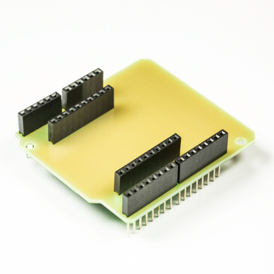

💾 Childboard Adaptershield
===========================

# 📸 Image

# 📂 Description

The LXRobotics Childboard Adaptershield allows the usage of Childboards (e.g. Gas Sensor or the Temperature Sensor) in combination with an Arduino Uno without requiring a Radio Shield.

**Features**

* Adapter from an Arduino Uno to a LXRobotics Childboard connector
* Integration of LXRobotics Childboards on an Arduino Uno without requiring a Radio Shield

# 🎥 [Video](images/childboard_adaptershield_demo.mp4)
